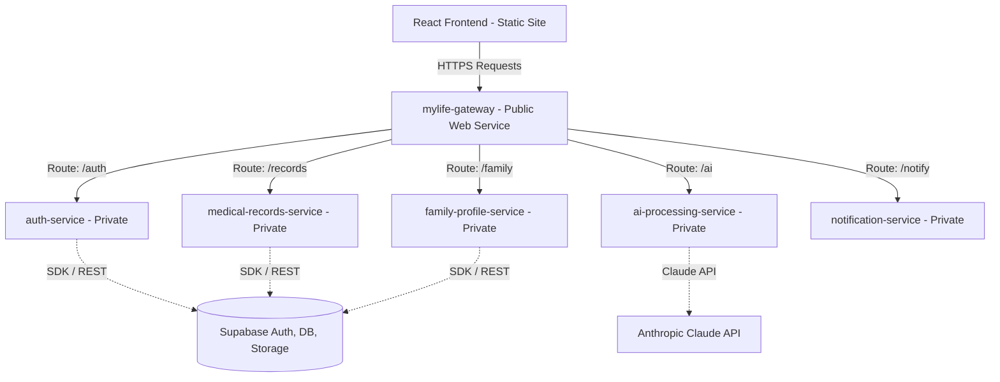

# 🚀 Deploying MYLIFE to Render

This guide outlines the steps required to deploy the complete MYLIFE full-stack platform—composed of 5 backend microservices, an NGINX API gateway, and a React frontend—to Render.

---

## 🏗️ Architecture Overview on Render

To maximize security and optimize cost, the architecture on Render uses **Private Services** for internal backend components and a single **Web Service** for the NGINX gateway.

---

## 📋 Prerequisites

Before deploying, ensure you have:
1. A [Render Account](https://render.com/).
2. A [Supabase Project](https://supabase.com/) set up (including database tables, JWT config, and storage buckets).
3. An [Anthropic API Key](https://console.anthropic.com/) (for AI medical record parsing).
4. Your code pushed to a Git repository (GitHub/GitLab).

---

## ⚡ Option A: Auto-Deployment using Blueprints (Recommended)

Render Blueprints allow you to deploy the entire backend stack with a single click using the `render.yaml` configuration file.

### Step 1: Push Changes
Ensure the newly created `render.yaml` and `gateway/Dockerfile` are committed and pushed to your backend repository.

### Step 2: Create a Blueprint Instance on Render
1. Log in to the [Render Dashboard](https://dashboard.render.com/).
2. Click **New +** in the top right, then select **Blueprint**.
3. Connect your backend Git repository.
4. Render will read the `render.yaml` file automatically and list the services to be created.
5. In the configuration page, you will be prompted to fill in the missing environment variables (e.g., `SUPABASE_URL`, `SUPABASE_SERVICE_KEY`, `JWT_SECRET`, etc.).
6. Click **Apply** to deploy the stack.

---

## 🛠️ Option B: Manual Backend Deployment

If you prefer deploying services individually through the dashboard:

### 1. Create Private Services
For each of the 5 microservices, create a **Private Service**:
- **Environment**: Select `Docker`.
- **Docker Context**: `services/<service-name>` (e.g., `services/auth-service`).
- **Dockerfile Path**: `services/<service-name>/Dockerfile` (e.g., `services/auth-service/Dockerfile`).

### 2. Configure Environment Variables
Ensure you apply the following environment variables in the settings of each service:

| Service | Environment Variable | Value/Description |
| :--- | :--- | :--- |
| **All Services** | `SUPABASE_URL` | Your Supabase project URL |
| | `SUPABASE_SERVICE_KEY` | Your Supabase service role API key |
| **auth-service** | `SUPABASE_KEY` | Anon public key |
| | `JWT_SECRET` | Secret key used for JWT signing |
| | `NOTIFICATION_SERVICE_URL` | `http://notification-service:8005` |
| **medical-records-service** | `SUPABASE_KEY` | Anon public key |
| | `JWT_SECRET` | Secret key used for JWT verification |
| | `AUTH_SERVICE_URL` | `http://auth-service:8001` |
| | `NOTIFICATION_SERVICE_URL` | `http://notification-service:8005` |
| | `AI_SERVICE_URL` | `http://ai-processing-service:8004` |
| **family-profile-service** | `JWT_SECRET` | Secret key used for JWT verification |
| | `AUTH_SERVICE_URL` | `http://auth-service:8001` |
| **ai-processing-service** | `CLAUDE_API_KEY` | Your Anthropic Claude API Key |
| | `NOTIFICATION_SERVICE_URL` | `http://notification-service:8005` |

### 3. Deploy NGINX Gateway (Web Service)
Deploy the API gateway as a public-facing **Web Service**:
- **Environment**: Select `Docker`.
- **Docker Context**: `gateway`.
- **Dockerfile Path**: `gateway/Dockerfile`.
- Render will assign a public URL (e.g., `https://mylife-gateway.onrender.com`). **Save this URL; you will need it for the frontend configuration.**

---

## 🖥️ Deploying the Frontend

You can host the React/Vite frontend on Render as a **Static Site**.

### Step 1: Create a Static Site on Render
1. Click **New +** and select **Static Site**.
2. Connect your frontend Git repository.
3. Configure the build settings:
   - **Build Command**: `npm run build`
   - **Publish Directory**: `dist`

### Step 2: Set Environment Variables
1. Go to the **Environment** tab of your frontend service.
2. Add a new variable:
   - **Key**: `VITE_API_BASE_URL`
   - **Value**: The public URL of your NGINX gateway (e.g., `https://mylife-gateway.onrender.com` - *do not add a trailing slash*).

---

## ⚠️ Important Considerations for Render Free Tier

> [!WARNING]
> If you are deploying on Render's **Free Tier**, keep the following limitations in mind:
> - **Spin-Down Delay**: Free Web and Private services will spin down (sleep) after 15 minutes of inactivity. When a new request arrives, it can take **50–90 seconds** for the service to wake up.
> - **Gateway Timeout**: Because the NGINX gateway relies on the microservices, if the backend services are sleeping, the first request will trigger a cold-start wakeup chain. You may see a `504 Gateway Timeout` or initial network delays. Once active, performance will return to normal.
> - **Active Wakeup**: To prevent sleeping on free instances in demo/presentation scenarios, you can use a free monitoring service like [UptimeRobot](https://uptimerobot.com/) to ping the health route (`https://mylife-gateway.onrender.com/health`) every 10–14 minutes.
